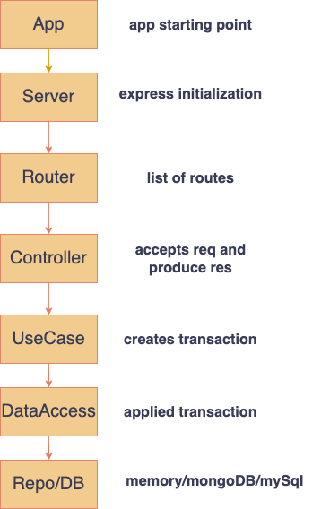

## Simple Microservice - Clean Architecture

#### Written in NodeJS + Typescript

<hr />

### Installation (both server and client)
```
npm install
cd client
npm install
```
#### add `.env` file at the root of the directory, with the following properties
```
PORT=<port_number>
MONGO_URI_SUFFIX=<i.e @cluster0.abcde.mongodb.net/?retryWrites=true&w=majority>
MONGO_USER=<mongo_user>
MONGO_PASSWORD=<mongo_password>
REDIS_HOST=<redis_host>
REDIS_PASSWORD=<redis_password>
REDIS_EXPIRE=<redis_expiration in seconds>
```

### Run both
#### in development mode:
```
 npm run start
```
<hr />

#### based on clean architecture pattern example [(GitHub project)](https://github.com/dev-mastery/comments-api)

<hr />


